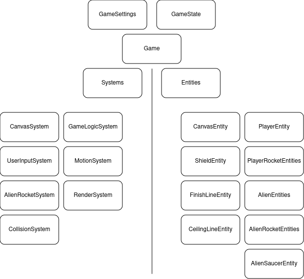
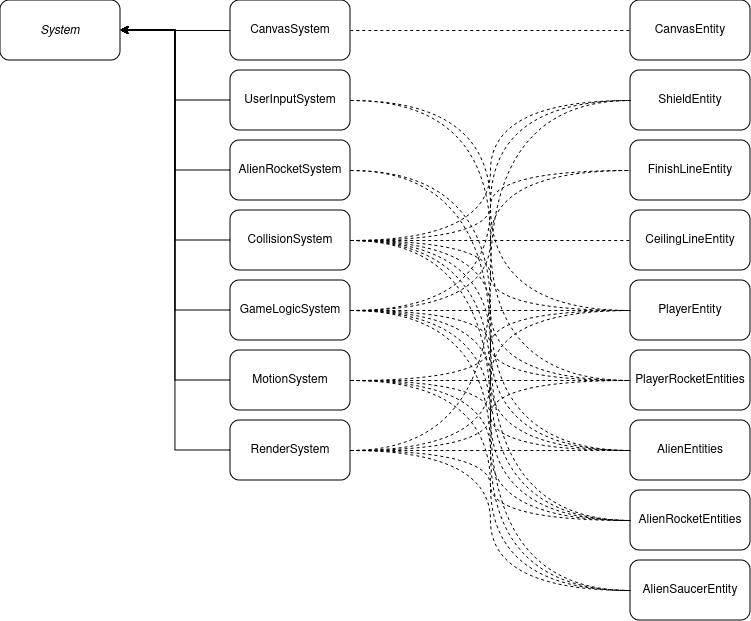
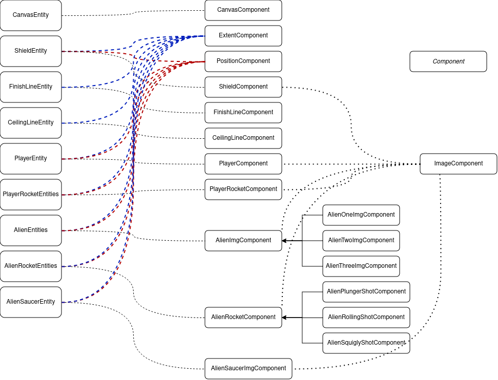

# 🚀 Welcome to Space Invaders
I hope you enjoy this code and the game. And perhaps also learn something form it.

This project does not use any libraries besides the development specific libraries.

What follows, was my TODO list of features and source references for this project.

## Feature list
- [x] PlayerComponent: Various player components and entities
- [x] AlienComponent: Various alien components and entities
- [x] MotionSystem: Updates the position of all in game entities
- [x] RenderSystem: Draws all in game entities
- [x] UserInputSystem: Listens to user keyboard events and spawns player rockets
- [x] AlienRocketSystem: Makes decision on when to spawn a new alien rocket
- [x] Add Alien saucer ship
- [x] ExtentComponent: A Box around the entities of interest for the Collision detection
- [x] CollisionSystem: detects collision between game objects
    - [x] AlienRocket -> Player
    - [x] AlienRocket -> Shield
    - [x] Alien -> Player
    - [x] Alien -> Shield
    - [x] PlayerRocket -> Alien
    - [x] PlayerRocket -> Saucer
    - [x] PlayerRocket -> Shield
    - [x] PlayerRocket <-> AlienRocket
- [x] Updating player score
- [x] GameLogic: Keep track of the scores, lives, game state in general. Currently, in the PlayerComponent
  - [x] All Aliens killed, go to next level
  - [x] Get killed by alien
  - [x] Get killed by rocket
  - [x] Aliens land
  - [x] Game speed, how to control it?
  - [x] The Aliens different levels. The Aliens levels are 1-(2,3,4)-(5,6,7) 16 pixels lower, 5 to 7 is just above the shields. 
- [x] Add various explosions
  - [x] Player exploding
  - [x] Player rocket exploding
  - [x] Alien exploding
  - [x] Alien rocket exploding, on shield and on floor
  - [x] Alien saucer ship exploding
- [ ] Various screens
  - [x] Intro screen
  - [x] Main screen
  - [x] Player respawn screen
  - [x] End screen
  - [x] Hi-score screen
  - [ ] Demo screen
- [x] Implement canvas scaling (ctx.setTransform())
- [x] Refactor/Review Systems/Components/Entities/Tags
- [x] Add Systems class for creating the systems
- [x] Add Entities class for creating the Entities
- [x] Introduce a game state object 
- [x] Introduce a game settings object
- [x] Introduce a global timeFrame, on which the game can base its rendering timing.
- [ ] Add a document explaining how the code is put together, with some images.

## Running the project
This project has been created using **webpack-cli**, you can now run
```
npm run start
```
to run your application
```
npm run build
```
to bundle your application

## Overview
### Game Overview

### System Entity relations

### Entity Component relations


## References
- [Computer Archeology - Space Invaders](https://computerarcheology.com/Arcade/SpaceInvaders/)
- [Wikipedia Space Invaders](https://en.wikipedia.org/wiki/Space_Invaders)
- How to Build an Entity Component System Game in Javascript [blog link] and [his repo]
- Space Invaders (1978) - 100% Longplay (No Commentary) [YouTube]

[blog link]: http://vasir.net/blog/game-development/how-to-build-entity-component-system-in-javascript
[his repo]: https://github.com/erikhazzard/RectangleEater
[YouTube]: https://youtu.be/uGjgxwiemms
